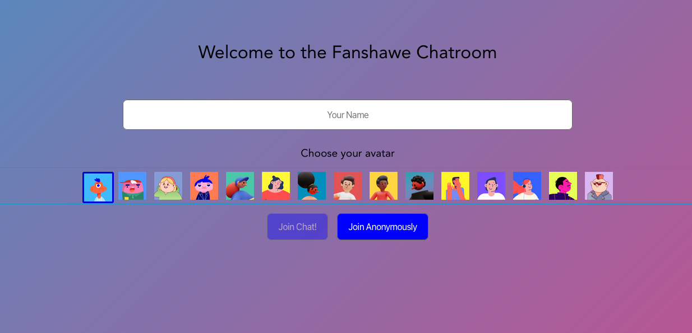
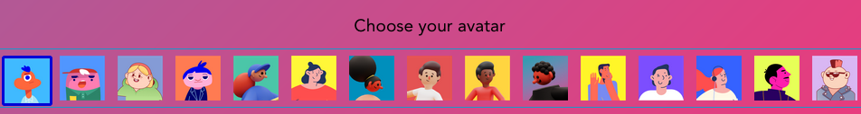
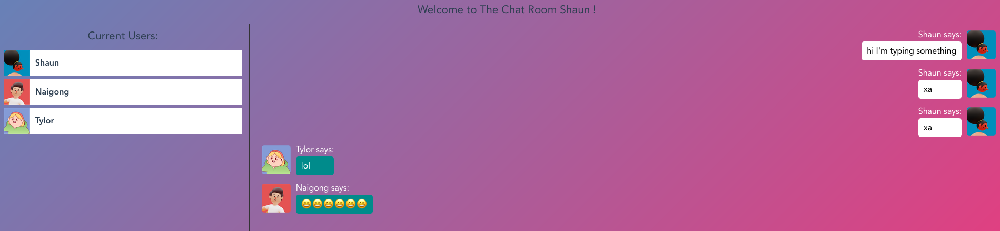
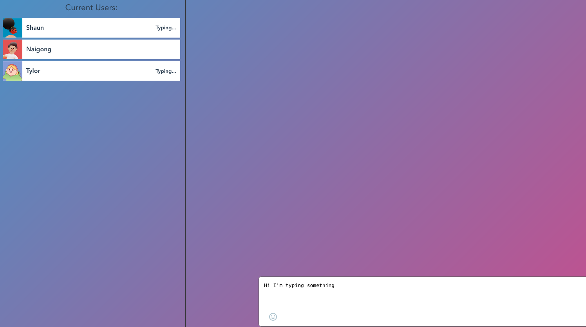
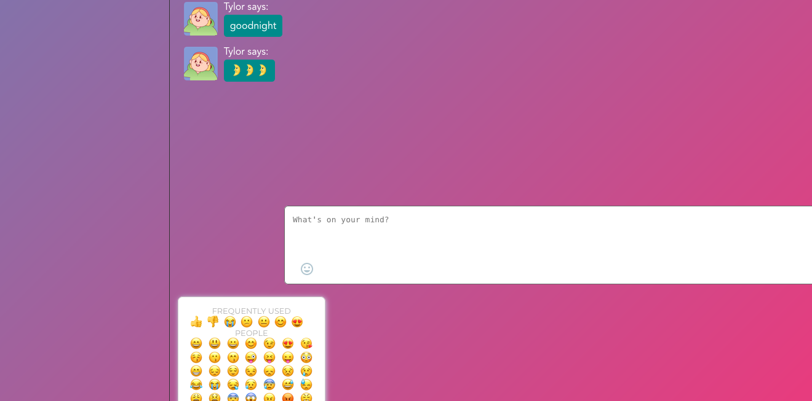

<p align="center">

 <a href="https://github.com/shaunwng/Wang_NG_Chat_App_Front_End.git">
        
    </a>
<h2 align="center">Fanshawe Chat App</h2>
  <h3 align="center">Wang_NG_Chat_App_Front_End</h3>

  <p align="center">
    This is the front end github repo for Chat App which build with Node, Express, and the Vue CLI, Scoket.io
  </p>

</p>

## Table of Contents
* [About the Project](#about-the-project)
  * [Built with](#built-with)
* [Getting Started](#getting-started)
  * [Prerequisites](#prerequisites)
  * [Installation](#installation)
* [New Functions](#new-functions)
* [References](#references)
* [Contact](#contact)
* [License](#license)


## About the Project
This is a live interactive chat application build with Node, Express, and the Vue CLI, Scoket.io.User can join into the chatroom and chat with each other like real 'online chat'. Have some fun with that!

### Built with

* HTML
* CSS
* JavaScript
* Sass
* Vue CLI
* Node
* Express
* Socket.io

## Getting Started
### Prerequisites
* npm
```sh
npm install npm@latest -g
```
### Installation

1. Clone the repo
```sh
git clone git@github.com:shaunwng/Wang_NG_Chat_App_Front_End.git
```
2. cd into chatapp_front folder
```sh
cd chatapp_front
```
3. Install NPM packages
```sh
npm install
```
3. Run serve at localhost:8080
```sh
npm run serve
```
App running at:
  - Local:   http://localhost:8080/
  - Network: http://192.168.2.120:8080/

## New Functions
* A custom avatar per user
    <p></p>
* Current User List ( Showing the User's username + avatar image )
    <p></p>
* Typing Notice ( When some user are typing something in the text area )
    <p></p>
* User Join and Exit Notice
    <p></p>
    <p></p>
* Emoji Picker
    <p></p>

## References
Vue package：
* vue-notification 👉[https://www.npmjs.com/package/vue-notification](https://www.npmjs.com/package/vue-notification)
* vue-chat-scroll 👉[https://www.npmjs.com/package/vue-chat-scroll](https://www.npmjs.com/package/vue-chat-scroll)
* vue-emoji-picker 👉[https://www.npmjs.com/package/vue-emoji-picker](https://www.npmjs.com/package/vue-emoji-picker)

Socket.io 👉 [https://socket.io/docs/v3/](https://socket.io/docs/v3/)

## Contact
Naigong Wang 👉 [Naigong's Github link](https://github.com/shaunwng)

## License

MIT License

Copyright (c) 2022 Shaun Wang

Permission is hereby granted, free of charge, to any person obtaining a copy
of this software and associated documentation files (the "Software"), to deal
in the Software without restriction, including without limitation the rights
to use, copy, modify, merge, publish, distribute, sublicense, and/or sell
copies of the Software, and to permit persons to whom the Software is
furnished to do so, subject to the following conditions:

The above copyright notice and this permission notice shall be included in all
copies or substantial portions of the Software.

THE SOFTWARE IS PROVIDED "AS IS", WITHOUT WARRANTY OF ANY KIND, EXPRESS OR
IMPLIED, INCLUDING BUT NOT LIMITED TO THE WARRANTIES OF MERCHANTABILITY,
FITNESS FOR A PARTICULAR PURPOSE AND NONINFRINGEMENT. IN NO EVENT SHALL THE
AUTHORS OR COPYRIGHT HOLDERS BE LIABLE FOR ANY CLAIM, DAMAGES OR OTHER
LIABILITY, WHETHER IN AN ACTION OF CONTRACT, TORT OR OTHERWISE, ARISING FROM,
OUT OF OR IN CONNECTION WITH THE SOFTWARE OR THE USE OR OTHER DEALINGS IN THE
SOFTWARE.